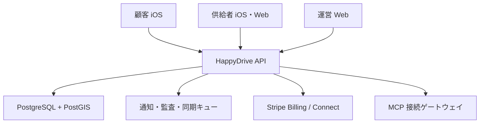

# 03 技術構成と接続

## 構成
`apps/ios` SwiftUI (customer/supplier role state)、`apps/supplier-web` Next.js、`apps/admin-web` Next.js、`services/api` TypeScript/Fastify、PostgreSQL/PostGIS、Redisジョブキュー、S3互換証跡保存、Stripe Billing/Connect（商用決定後）、APNs/SMS、MCP connector。初期は境界の明確なモジュラーモノリス。CloudflareはDNS/WAF/静的フロント、API/DBは日本リージョンのマネージド基盤を推奨。CI/CD・バックアップ・監視・シークレット管理を含む。

## API境界
`identity`（電話OTP/本人/ロール/組織RBAC）、`catalog`（企業/サービス/エリア/審査）、`requests`（依頼/状態/ロック/証跡/QR）、`billing`（顧客/供給者subscription/枠/個別料金台帳）、`dispatch`（条件フィルタ/推薦）、`delivery`（供給者ルート/配達先/日報）、`messaging`（案件内連絡/通知/通報）、`integrations`（MCP）、`admin`（審査/紛争/返金/監査）。iOSとWebは同一API・OpenAPIから型生成。スマホ上の状態はサーバーを唯一の正とし、ローカルキャッシュは期限と再同期規則を持つ。

## 供給者MCP連携
供給者はURLを登録→運営/組織管理者が所有権とTLS/許可ドメインを検証→OAuth同意→サーバーが`list_services`, `get_service`, `list_availability`など許可された読取ツールを列挙・接続確認→プレビュー/差分レビュー→供給者が選択してサービス公開申請。MCPはサービス台帳へ入力するアダプタであり、顧客の住所やカードを外部サーバーへ渡さない。権限は供給者組織に限定、トークンはサーバーのシークレット保管、監査・失効・再認証・タイムアウト・レート制限・SSRF対策・公開ネットワークの許可を実装。外部から戻る説明は非信頼データとして表示/価格/資格を検証し、人間の承認前に自動公開しない。同期時に手動変更との差分/衝突を提示。MCP利用不能時も手動登録を利用可能にする。標準仕様との互換を対象サーバーで検証。

## 地図・配送
MapKitで地図、Core Locationで必要時の現在地、Appleマップへのナビ。複数配送先のルート最適化は所要時間行列+時間指定/休憩/容量の制約付き計算をサーバーで実装。MapKitの二地点案内だけで多地点最適化済みと表現しない。運転中の複雑な操作を制限。訪問案件と配送停止地点を一つの予定へ統合して重複を防止。住所検索/手入力/CSV/写真OCRは確認後に確定。通信断では既取得の予定を閲覧でき、受諾/QR/決済はオンラインでのみ確定。

## セキュリティ/運用
短命access token、ローテーションrefresh token/Keychain、OTP制限、供給者管理者MFA、組織ごとの行レベル認可、全書込のIdempotency-Key、outbox/Webhook event ID重複排除。位置・写真・住所・評価・請求の最小保存/暗号化/保持期限。Evidence URLは短命で所有権検査。監査ログはactor/id/時刻/理由のみ、電話・住所・QR token・カードなし。p95 API/受諾競合/QR検証/Stripe Webhook/同期失敗/通知失敗/課金枠誤算の監視とアラート。RPO≤1h/RTO≤4hは設計目標として演習で証明。

## 初期企業の扱い
シードは `invited_unverified` の組織名のみ。OTERA、トーカイ、Nurse and Craftを初期データとして記録するが、事業許諾/登録メール/審査/カード/公開サービスを本人が行うまで顧客の検索結果と販促画面には出さない。提供画像にある企業のロゴや「提携済み」表記を無許諾で実装しない。
